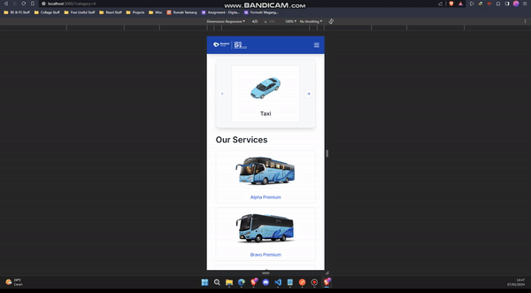
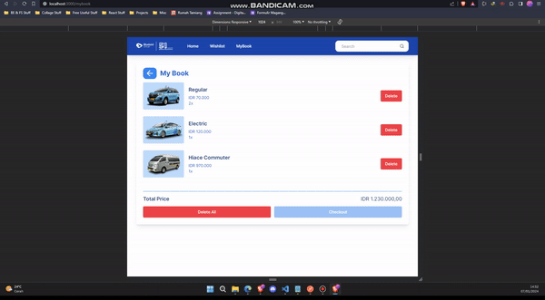
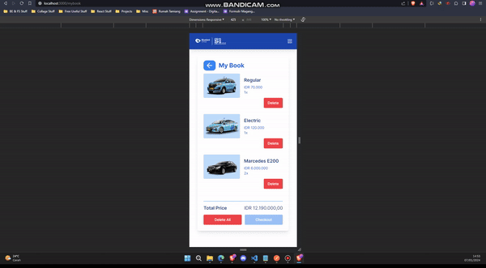
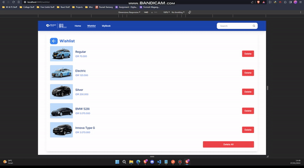
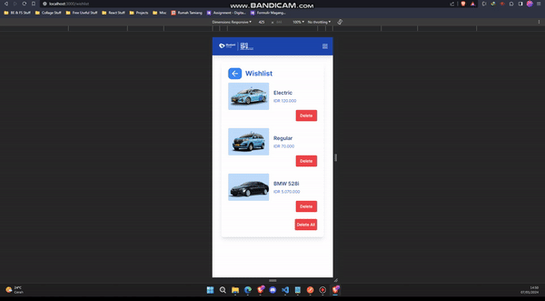
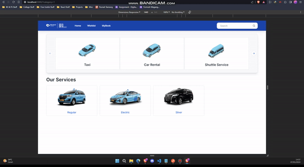
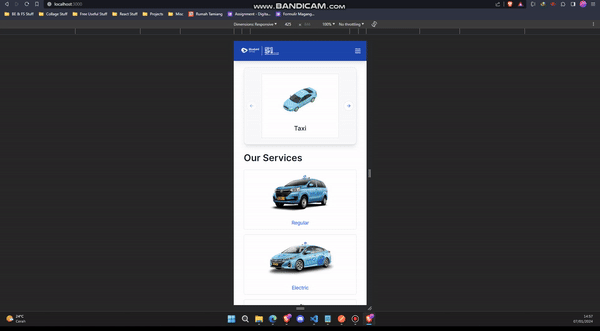
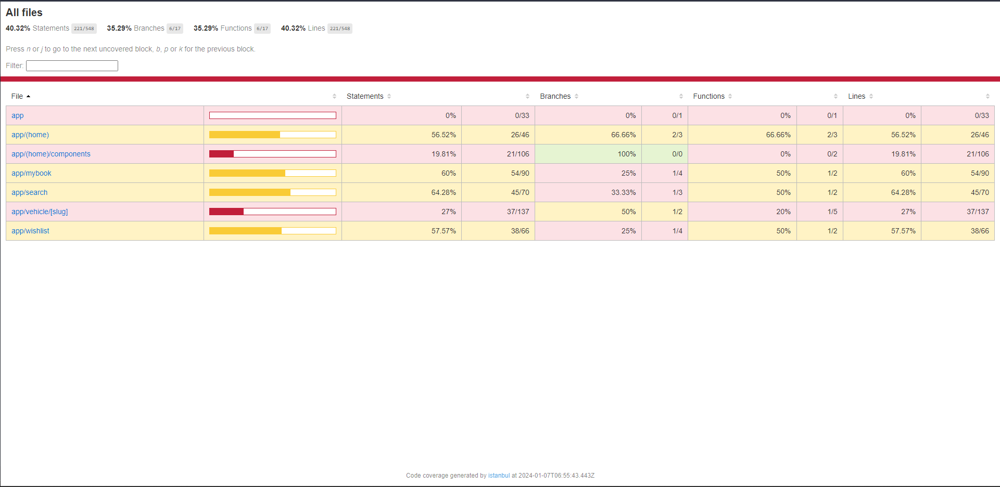

## Bluebird Test - Frontend React Developer

Name : Alfan Olivan

### Tech Stack

- NextJS 14 + Typescript (React Framework)
- TailwindCSS + Shadcn UI (UI Component)
- React Query (Data Fetching & Caching)
- Zustand (State Management)
- Jest + Enzyme (Unit Testing)

### SSR Pages

- Home:
  - Category List
  - Vehicle List

### CSR Pages

- Vehicle Detail
- myBook
- Wishlist
- Search

### Demo App

- Homepage:

  - Large Screen:

    

  - Mobile Screen:

    

- Vehicle Detail:

  - Large Screen:

    

  - Mobile Screen:

    

- myBook:

  - Large Screen:

    

  - Mobile Screen:

    

- Wishlist:

  - Large Screen:

    

  - Mobile Screen:

    

- Search:

  - Large Screen:

    

  - Mobile Screen:

    

### Unit Test Coverage

